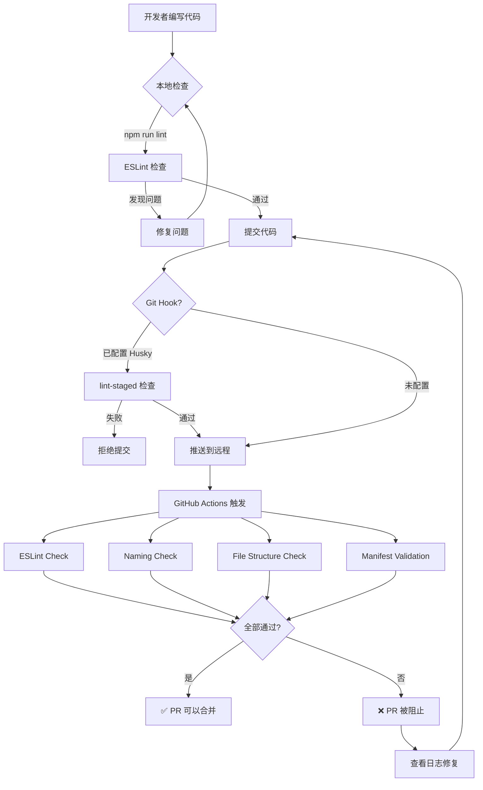

# 自动化代码审查 - 实施完成报告

## ✅ 已完成的工作

### 1. ESLint 配置系统

#### 创建的文件
- ✅ `.eslintrc.json` - ESLint 主配置文件（177行）
- ✅ `.eslintignore` - 忽略文件配置
- ✅ `package.json` - 项目配置和脚本

#### 核心功能
**命名规范检查**（基于 FavGallery 开发规则）：
```javascript
// ❌ 禁止的术语
videoId, awemeId     → 应使用 workId
userId, secUid       → 应使用 authorUid 或 platformId
favId, favoriteId    → 应使用 collectId

// ❌ 禁止硬编码
'DouYin'             → 应使用 CONFIG.ACTIVE_PLATFORM
```

**代码质量检查**：
- 强制驼峰命名（camelcase）
- 禁止未使用的变量（no-unused-vars）
- 强制使用 const/let（no-var, prefer-const）
- 禁止空 catch 块（no-empty）
- 强制使用 ===（eqeqeq）

**可用命令**：
```bash
npm run lint          # 运行检查（显示所有问题）
npm run lint:fix      # 自动修复可修复的问题
npm run lint:strict   # 严格模式（有警告也失败）
```

---

### 2. GitHub Actions 工作流

#### 创建的文件
- ✅ `.github/workflows/code-quality.yml` - CI/CD 工作流（155行）

#### 检查任务

**Task 1: ESLint Check**
- 运行 `npm run lint:strict`
- 有任何错误或警告都会导致 PR 失败
- 确保代码符合规范

**Task 2: Naming Convention Check**
- 使用 grep 检查错误术语
- 检查硬编码平台值
- 快速发现命名问题

**Task 3: File Structure Check**
- 验证必需的目录结构
- 验证必需的文件存在
- 确保项目完整性

**Task 4: Manifest Validation**
- 验证 manifest.json 格式
- 检查必需字段
- 确保扩展配置正确

#### 触发条件
```yaml
on:
  push:
    branches: [main]        # 推送到 main 时
  pull_request:
    branches: [main]        # 创建 PR 时
```

---

### 3. Git 钩子系统（可选）

#### 创建的文件
- ✅ `.huskyrc.json` - Husky 配置
- ✅ `.lintstagedrc.json` - lint-staged 配置

#### 功能
- **pre-commit**: 提交前自动运行 lint-staged
- **lint-staged**: 只对暂存的文件运行 ESLint
- **优势**: 防止不符合规范的代码进入仓库

#### 安装（可选）
```bash
npm install husky lint-staged --save-dev
npx husky install
```

---

### 4. 文档系统

#### 创建的文件
- ✅ `docs/AUTOMATED_REVIEW_SETUP.md` - 完整的设置和使用指南（300行）
- ✅ `.gitignore` - Git 忽略配置

#### 更新的文件
- ✅ `README.md` - 添加了自动化审查文档链接

---

## 📊 工作流程图



---

## 🎯 使用场景

### 场景 1: 日常开发

```bash
# 1. 编写代码
vim api/douyin/api.js

# 2. 保存后，编辑器自动提示 ESLint 错误
# VS Code: 安装 ESLint 扩展后会实时显示

# 3. 手动运行检查
npm run lint

# 4. 自动修复
npm run lint:fix

# 5. 提交代码
git add .
git commit -m "feat: add new API method"
git push
```

### 场景 2: 提交 PR

```bash
# 1. 创建功能分支
git checkout -b feature/new-feature

# 2. 开发并测试
# ... 编码 ...

# 3. 确保通过本地检查
npm run lint:strict

# 4. 提交并推送
git add .
git commit -m "feat: implement xxx"
git push origin feature/new-feature

# 5. 在 GitHub 创建 PR
# GitHub Actions 自动运行
# 等待所有检查通过

# 6. 审查者查看检查结果
# 如果全部通过，可以合并
```

### 场景 3: 审查代码

```bash
# 1. 打开 PR 页面
# 2. 查看 "Checks" 标签
# 3. 确认所有任务通过：
#    ✅ ESLint Check
#    ✅ Naming Convention Check
#    ✅ File Structure Check
#    ✅ Manifest Validation

# 4. 如果有失败，点击详情查看错误
# 5. 要求开发者修复后重新提交
```

---

## 🔍 检查示例

### 示例 1: 命名错误

**代码**:
```javascript
const videoId = '7xxx';  // ❌ 错误
```

**ESLint 输出**:
```
error  ❌ 禁止使用 videoId/awemeId，请使用 workId  no-restricted-syntax
```

**修复**:
```javascript
const workId = '7xxx';  // ✅ 正确
```

---

### 示例 2: 硬编码平台值

**代码**:
```javascript
const platform = 'DouYin';  // ❌ 错误
```

**GitHub Actions 输出**:
```
❌ 发现硬编码的平台名称 'DouYin'，请使用 CONFIG.ACTIVE_PLATFORM 或 platformAPI
```

**修复**:
```javascript
const platform = CONFIG.ACTIVE_PLATFORM;  // ✅ 正确
```

---

### 示例 3: 缺少分号

**代码**:
```javascript
const workId = '7xxx'  // ❌ 缺少分号
```

**ESLint 输出**:
```
error  Missing semicolon  semi
```

**修复**:
```javascript
const workId = '7xxx';  // ✅ 正确
```

---

## 📈 预期效果

### 代码质量提升
- ✅ 统一的命名规范
- ✅ 消除硬编码
- ✅ 减少低级错误
- ✅ 提高代码可读性

### 开发效率提升
- ✅ 自动化检查，减少人工审查时间
- ✅ 即时反馈，快速发现问题
- ✅ 自动修复，节省手动修改时间

### 团队协作改善
- ✅ 标准化的代码风格
- ✅ 清晰的审查流程
- ✅ 减少争议和讨论

---

## 🚀 下一步行动

### 立即可做
1. **安装依赖**
   ```bash
   npm install
   ```

2. **测试 ESLint**
   ```bash
   npm run lint
   ```

3. **阅读文档**
   - [AUTOMATED_REVIEW_SETUP.md](./docs/AUTOMATED_REVIEW_SETUP.md)
   - [DEVELOPMENT_RULES.md](./docs/DEVELOPMENT_RULES.md)

### 短期计划（1周内）
1. **团队培训**
   - 讲解 ESLint 规则
   - 演示如何使用
   - 解答疑问

2. **配置编辑器**
   - VS Code: 安装 ESLint 扩展
   - WebStorm: 启用 ESLint 集成

3. **试点运行**
   - 选择几个 PR 试用
   - 收集反馈
   - 调整规则

### 中期计划（1个月内）
1. **启用 Husky**（可选）
   ```bash
   npm install husky lint-staged --save-dev
   npx husky install
   ```

2. **优化规则**
   - 根据实际使用情况调整
   - 添加新的检查项
   - 简化过于严格的规则

3. **完善文档**
   - 补充常见问题
   - 添加更多示例
   - 录制演示视频

---

## 📞 支持与维护

### 遇到问题？

1. **查看文档**
   - [AUTOMATED_REVIEW_SETUP.md](./docs/AUTOMATED_REVIEW_SETUP.md) - 完整设置指南
   - [QUICK_REFERENCE.md](./docs/QUICK_REFERENCE.md) - 快速参考

2. **查看日志**
   - ESLint 输出会明确指出问题和位置
   - GitHub Actions 提供详细的失败原因

3. **寻求帮助**
   - 提交 Issue
   - 联系代码所有者

### 维护建议

- **每月回顾**: 检查规则是否合理
- **收集反馈**: 听取团队意见
- **持续优化**: 根据实际情况调整
- **保持更新**: 跟进 ESLint 新版本

---

## 🎉 总结

现在您的项目拥有：

✅ **完整的 ESLint 配置** - 自动检查命名规范和代码质量  
✅ **GitHub Actions 工作流** - PR 自动审查，防止不合格代码合并  
✅ **Git 钩子支持** - 提交前自动检查（可选）  
✅ **详细的使用文档** - 300行完整指南  
✅ **清晰的示例** - 正误对比，易于理解  

这套自动化审查体系将：
- 🎯 确保所有代码符合开发规范
- 🚀 提高代码质量和一致性
- 🤝 降低审查成本和沟通成本
- 📚 帮助新成员快速适应

---

**开始使用吧！**

```bash
# 第一步：安装依赖
npm install

# 第二步：运行检查
npm run lint

# 第三步：阅读文档
cat docs/AUTOMATED_REVIEW_SETUP.md
```
